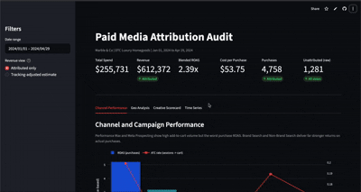
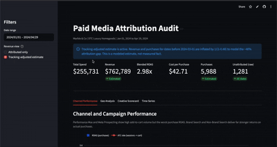

# Paid Media Attribution Audit: Finding the Revenue a Broken Conversion Setup Was Hiding

A self-contained marketing analytics case study that walks through a realistic
paid media measurement problem from raw data to stakeholder dashboard.

**Live dashboard:** https://paid-media-attribution-audit-vw5acidxm2cygewkvpjhpq.streamlit.app/

**Audience:** Marketing ops / MarTech recruiters and prospective clients.
**Data:** Synthetic. Methodology mirrors a real engagement.

---



---

## The Problem

A DTC luxury homegoods brand (Marble & Co, fictional) had a paid media account
that looked healthy in platform dashboards but had three silent problems:

- **~40% of purchases were disappearing.** A broken tracking setup dropped 35-45%
  of real purchases into a Direct/Unattributed bucket for 60 days. When the fix
  landed, attributed revenue appeared to jump 60%. Stakeholders celebrated. The
  numbers were not real.
- **Two campaigns were optimized for the wrong goal.** Performance Max and Meta
  Prospecting were set to optimize for add-to-cart. Their ATC rates were the
  highest in the account. Their purchase ROAS was 0.9x to 1.5x. They were
  spending more than they earned.
- **A strong market was being ignored.** Portugal had nearly 2x the network CTR
  and the best purchase ROAS in the account, receiving 3% of total spend.

## What the Data Showed

Five findings, quantified:

1. **Optimization mismatch:** Performance Max delivered a 19% ATC rate (highest
   in the account) but only a 6% ATC-to-purchase rate. Meta Prospecting: 17% ATC
   rate, 2% ATC-to-purchase. Brand Search: 18% ATC rate, 57% ATC-to-purchase.
   Switching bid strategies to purchase targets is the single highest-leverage fix.

2. **Tracking break and false signal:** Pre-fix (days 1-60), unattributed purchases
   averaged 38-40% of total. Post-fix, unattributed dropped to 2-5%. Total
   purchases were flat across the boundary. The apparent 60% jump in attributed
   revenue is a measurement artifact, not demand growth.

3. **PT geo opportunity:** Portugal CTR is 1.95x the US baseline. Purchase ROAS in
   PT is 1.85x the US baseline. Current spend share: 3%. Modeled revenue uplift
   from expanding PT to 8% of budget (at 70% of current ROAS to be conservative):
   see notebook Scenario B.

4. **Price event:** A 12% AOV increase on day 75 caused a 2-week CVR dip of
   roughly 18-20%, then natural recovery. This explains a revenue wobble that
   could otherwise be misattributed to media performance.

5. **Creative concentration:** Two of six Meta creatives (meta_c01, meta_c02) drive
   73% of Meta purchases on 56% of Meta spend. The four tail creatives spend 44%
   of Meta budget at below-average ROAS.

## The Dashboard



Live: https://paid-media-attribution-audit-vw5acidxm2cygewkvpjhpq.streamlit.app/

The Streamlit app lets a stakeholder:
- Toggle between attributed-only and tracking-adjusted revenue estimates.
- See the ATC vs purchase mismatch by campaign in a single chart.
- Identify the PT opportunity from the geo view.
- Inspect the creative scorecard for Meta budget concentration.
- Read the time series with the two annotated events (tracking fix, price increase).

## How It Works

**Stack:** Python, pandas, numpy, DuckDB, Plotly, Streamlit.

**MarTech concepts on display:**

- Event-based funnel modeling (sessions, ATC, checkout, purchase, revenue at
  channel / geo / creative grain).
- Attribution coverage analysis: quantifying the tracking gap and applying a
  gap correction without presenting it as measured fact.
- Channel and campaign ROAS modeling with the add-to-cart vs purchase mismatch
  pattern that appears whenever platforms are set to the wrong optimization goal.
- Geo ROAS decomposition and spend-share vs revenue-share analysis.
- Creative ROAS and purchase contribution scoring.
- A DuckDB SQL transformation layer: four models (staging, channel, geo, creative)
  that run in-process with no infrastructure.

**SQL models (models/):**

| File | Purpose |
|------|---------|
| `stg_events.sql` | Joins spend and events, derives CTR, CVR, ROAS, CPA, CPC, attribution flag, tracking-period flag |
| `fct_channel_performance.sql` | Rollup by channel and campaign |
| `fct_geo_performance.sql` | Rollup by geo with spend share and revenue share |
| `fct_creative_performance.sql` | Rollup by Meta creative with purchase contribution |

## Run Locally

```bash
git clone https://github.com/[your-handle]/paid-media-attribution-audit
cd paid-media-attribution-audit

python -m venv venv
source venv/bin/activate          # Windows: venv\Scripts\activate
pip install -r requirements.txt

python data/generate.py           # generates data/sample/*.csv
python models/build.py            # runs SQL models, writes data/output/*.csv
python analysis/create_notebook.py  # generates analysis/diagnosis.ipynb

streamlit run app.py
```

The Jupyter notebook:
```bash
jupyter notebook analysis/diagnosis.ipynb
```

## Deploy to Streamlit Community Cloud

1. Push this repo to GitHub (public).
2. Go to [share.streamlit.io](https://share.streamlit.io) and sign in with GitHub.
3. Click "New app", select this repo, set the main file to `app.py`, click Deploy.
4. Once deployed, copy the URL Streamlit provides.
5. Replace the Streamlit URL placeholders in this README with the deployed URL.
6. Commit and push: `git add README.md && git commit -m "add Streamlit deploy URL" && git push`.

The `data/output/` CSVs are committed to the repo so the app runs on Community
Cloud without a build step.

---

*The data in this project is synthetic. The measurement problems, analysis methods,
and reallocation logic mirror patterns from real paid media engagements.*

*Want this run on your own paid media data? Reach out: bellam.amine@gmail.com*
